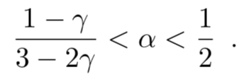
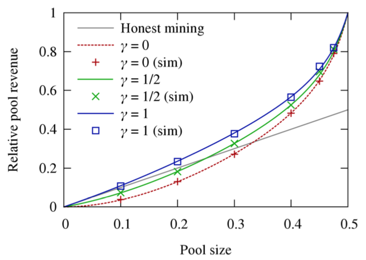
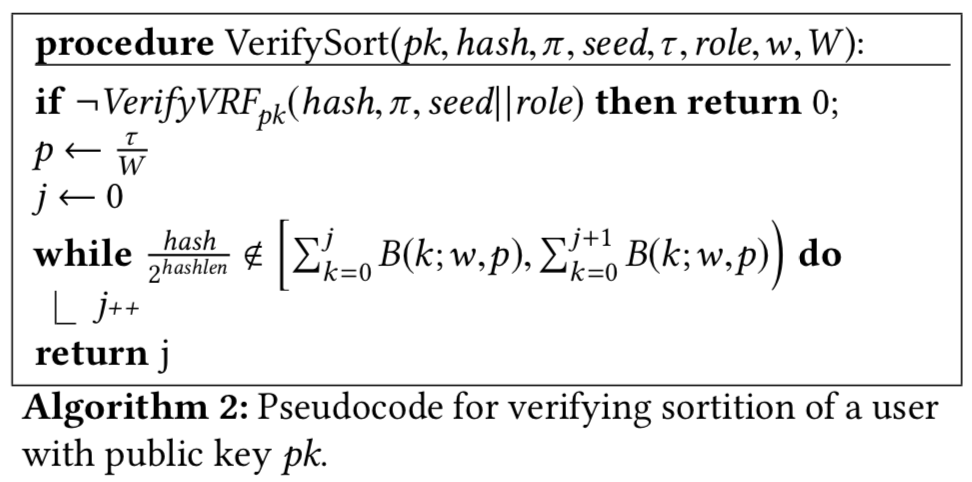
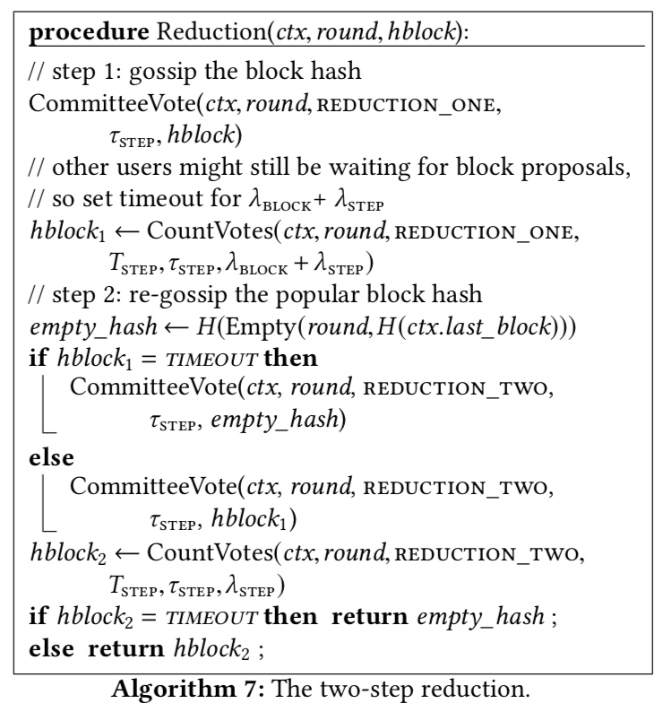

# 比特币与区块链

### 哈尔滨工业大学 网络与信息安全 张宇 2018

---

## 1. 比特币(Bitcoin)与区块链(Blockchain)

### 1.1. 介绍

- [Bitcoin(比特币)](https://en.wikipedia.org/wiki/Bitcoin)是一种加密货币(cryptocurrency)，于2008年在密码朋克(Cypherpunks)邮件列表中的一份[以中本聪为笔名的白皮书](https://bitcoin.org/bitcoin.pdf)中被提出，紧接着原始参考客户端的源代码([Bitcoin Core](https://bitcoincore.org))被发布。比特币是第一个实践上解决了双重支付(double-spending)问题的数字货币，而不需要依赖于可信的第三方或中央服务器。比特币的创世块在2009年1月3日被挖出。比特币首次作为现金被使用是通过2010年5月的一笔交易，一名用户以1万比特币作为交换，为另一个人订了一份比萨饼外卖。[2018年1月，比特币市值已经达到2千5百亿美元](https://coinmarketcap.com/currencies/bitcoin/)。

- [区块链(Blockchain)](https://en.wikipedia.org/wiki/Blockchain)，作为比特币核心技术组件之一，现在已经泛指整个比特币所采用技术的集合。狭义上，区块链是一种分布式数据结构，指一个不断增长、顺序相连的记录列表，每个记录被称为“区块”，块内包含若干交易(transaction)。区块链的主要功能之一是作为一个分布式的“公开记账簿”(public ledger)来记录各方之间的交易，具有可验证、只追加、防篡改等性质。

比特币的其他核心技术组件还包括交易与脚本、基于[工作量证明(PoW)](https://en.wikipedia.org/wiki/Proof-of-work_system#Bitcoin-type_proof-of-work)的共识(consensus)机制、P2P网络等。

### 1.2. 理解比特币

- 普林斯顿大学课程[《Bitcoin and Cryptocurrency Technologies》](http://bitcoinbook.cs.princeton.edu)

下面给出一个对比特币/区块链技术的理解。

#### 1.2.0 货币与数字货币

- 百度百科：货币本质上是一种所有者与市场关于交换权的契约，根本上是所有者相互之间的约定。吾以吾之所有予市场，换吾之所需，货币就是这一过程的约定，它反映的是个体与社会的经济协作关系。
- 数字货币与纸币一样，本质上都属于纯信用货币。数字货币的具体形态可以是以一个来源于实体账户的数字，也可以是记于名下的一串由特定密码学与共识算法验证的数字。

比特币可以看作是一种“记账货币”（money of accounts）：在一个账户上的一个数字（余额），包含信用账目及其清算所构成的体系。与通常的纸币类似，具有以下性质。

- 不可窃取货币：余额不能凭空减少。
- 不可伪造货币：余额不能凭空增加。

与一般安全问题相似，数字货币满足安全需求依赖于两点：信任假设与安全机制。

#### 1.2.1 交易、账簿、公钥与数字签名

假设在一次Alice与Bob的交易中，Alice向Bob转帐10元钱，用于购买Bob做的一张披萨饼（或其他任何商品，甚至什么也不买）。在数字世界中，并没有实物的钞票或硬币，这次交易只是一个信息，称做一条交易记录：

```
From: Alice  To: Bob  Amount: 10 
```

这里我们并不关心披萨饼。从信息安全角度，该交易以及账簿需要满足以下安全属性：

- 真实性：不能伪装成其他人，否则会被发现。
- 完整性：交易发生后，不能更改交易内容，否则会被发现。
- 不可否认性：交易发生后，双方不能否认该交易。

如果Alice或Bob只有一个人做记录，则这个做记录的人可以随意打破上述安全属性。所以，两个人应该分别在各自的账簿中做记录。假想这样一种情况，全世界只有Alice和Bob两个人，那么以上安全属性是否天然地满足了，或者这些安全属性已经毫无意义？

- 真实性：若Bob伪装成Alice伪造上述交易，则Alice通过查看自己的账簿可以发现。满足！
- 完整性：某一个人篡改账簿，则另一个人会发现。满足！
- 不可否认性：若Alice否认交易，则Bob也无计可施。反之一样。或者说此时，二者之间的不可否认性没有意义！

为了满足不可否认性，Alice和Bob一致同意引入一个双方都信任的公证人Charlie。Charlie做公正的方法是对每笔交易做记录，当Alice和Bob发生争议时，以Charlie自己的账簿为准。不可否认性也得到了满足！同时，Charlie也可以检查真实性与完整性。这种三个人的记账方法被称为“三式记账法”(triple-entry bookkeeping)。

Alice真的有10元钱吗？把这个问题先放一边，考虑这次交易如果成功，则Bob的账户多了10元钱，此后Bob可支出10元钱。如果能证明Alice在之前的交易中获得了超过10元钱，并且到此次交易之前账户余额仍超过10元钱，则意味着Alice也能够支付10元钱。Bob在交易前可以向Charlie询问关于Alice的账户是否多余10元钱。

与参与交易的当事人不同，Charlie并不是直接地获得原始交易记录，而是间接地通过交易方获得。Charlie也需要向其他人提供交易记录。因此，在交易记录传播过程中也需要满足上述安全属性。

此时，公钥密码学中的数字签名有了用武之地。Alice公布其公钥，并用对应私钥对交易记录签名。Charlie在内的所有人可以用Alice的公钥验证记录。如何安全地获得Alice的公钥，此处不做讨论。考虑到Bob是获利方，并简化问题，不需要Bob的数字签名。那么，交易记录内容如下：

```
From: Alice  To: Bob  Amount: 10 
Sig: a signature signed by Alice
```

付款方的数字签名提供了 真实性+完整性+不可否认性：只有Alice才能产生有效签名。只要有Alice的公钥，上述安全属性可以公开验证。

为此，Charlie需要维护一个`From`字段中账号ID与用来验证`Sig`字段的公钥的映射表。其实，Charlie关心的并不是一个账号的ID，而是ID与公钥的映射关系，那么就可以把公钥（或其密码学哈希值，称为比特币地址）直接作为账号。这样，`From`字段就可以填上Alice（具体叫什么名字已经没有实际意义）的公钥。

紧接着此次交易之后，Bob打算向其他人转账5元钱，并提交一个新交易记录给Charlie。此时，Charlie需要确认上次交易里收款方`To`字段里的Bob和此次交易`From`里付款方公钥的映射关系。显然，这个映射也可以通过将`To`字段填充上收款方的公钥来省略。以公钥为账户就避免了这种额外的映射。这样之前交易记录的内容如下：

```
From: Alice's pub key  To: Bob's pub key   Amount: 10
Sig: a signature siged by Alice
```

至此我们设计了一种记账货币：

- 信任假设：负责记账的Charlie是可信的。
- 安全机制：带有数字签名的交易记录在账簿上。

该货币满足基本需求：

- 不可窃取货币：余额不能凭空减少。
- 不可伪造货币：余额不能凭空增加。

#### 1.2.2 比特币交易与区块链

Charlie记账时需要对交易排序，比特币采用一种逻辑时间戳方式的纪录方式：

- 每个交易包含一个排序：输入队列和输出队列；转账记录被包含在交易输出中。
- 交易输入包含指向之前交易输出的索引，其中本次交易输出的付款人是之前交易输出收款人。
- 每个交易中输入之和大于等于输出之和。尚未支出的输出，即未被后面的交易作为输入的输入，称为UTXO(Unspent Transaction Output)。
- 签名：整个交易由付款人签名，放在输入中。
- 近似固定时间间隔内的所有交易打包记录，称为“区块”(Block)。
- 每一区块中包含前一区块内容的哈希值，以此区块顺序相连构成账簿，称为“区块链”。

区块链记录了每一笔交易，由此可以计算出账户的UTXO。

交易示意图：

```
      +-Transaction 1------------------+      +-Transaction 2------------------+
      | Inputs:                        |      | Inputs:                        |
   +--+--Index (hash)                  |   +--+--Index (hash)                  |
   |  | Sig: signature signed by Alice |   |  | Sig: signature signed by Bob   |
   |  |                                |   |  |                                |
   |  | Outputs:                       |   |  | Outputs:                       |
---+  | To: Bob's pub key   Amount: 10 <---+  | To: Dave's pub key   Amount: 10|
      +------------------+-------------+      +--------------------------------+
```

区块链示意图：

```
  +--Block1--+      +--Block2--+       +--Block3--+
  |  Nonce   |      |  Nonce   |       |  Nonce   |
--+ -hash    |<-----+ -hash    | <-----+ -hash    |
  |  Trans1  |      |  Trans3  |       |  Trans5  |
  |  Trans2  |      |  Trans4  |       |  Trans6  |
  |  ...     |      |  ...     |       |  ...     |
  +----------+      +----------+       +----------+
```


#### 1.2.3 双重支付与分布式一致性

- 双重支付：假设Alice从一笔交易A中收入10元，在一笔新交易B中以该交易A向Bob支付10元钱的同时，在另一笔交易D中也以交易A向Dave支付10元钱。
- 为防范“双重支付”，采用“先记账，后交易”的方法：
	- Charlie保证此前交易T收入尚未被支付，将交易B或D中的一个写入账簿中，T被支付。
	- Bob或Dave查看Charlie的账簿，若该交易B／D被记录，则执行该交易。
	- Alice若实施双重支付，则要在账簿中写入两笔交易，而其中较晚的交易由于T已经被支付而无效。

只要Charlie是可信的，则“双重支付”问题可以避免。

打破假设：Charlie作恶，例如故意不记录某些交易，或维护多个不同的账簿，或者账簿被烧毁了，则之前的安全属性无法满足。那么我们应该相信谁，或者说谁来记录并维护这个账簿，谁有记账权？

比特币的思想是不相信某个特定的人，而是相信“大多数人是好的”，信任多数人的意见。Bob调整了确认Alice支付交易已经被记入账簿的条件，询问足够多的人（例如超过全体记账人的一半），如果这些人都确认记录了该笔交易，则Bob才认为交易有效。只要大多数人如实地记账，Alice若双重支付，则会被大多数人记录并发现。

比特币系统中有多人负责记账，称为“分布式账簿”。进一步的，系统是开放的，记账人并没有事先约定，可以随时加入和退出。这种复杂性带来了两方面安全问题：

- 一致性问题：无法获知系统全局状态，例如有多少记账人。一个交易记录在发送给记账人的过程中可能被阻断、丢失或者延迟，或者攻击者对不同的记账人发送不同的交易记录，导致不同的账簿不一致。

分布式账簿不一致，称为区块链“分叉”，存在“双重支付”风险：分叉之前Alice有一笔10元收入交易，此后在一个Bob所查看的账簿上记录付给Bob，在另一个Dave所查看账簿上记录付给Dave；Bob和Dave单独看各自账都会承认交易有效。

不幸的是，当前理论研究已经证明实现上述问题是无法解决的。

- CAP定理指出，一致性(C，所有复本都一样)、可用性(A，对状态查询做出应答)和分割容忍(P，网络被分割成多个互不连通的部分)三者只能同时满足两点，即当网络分割不可避免时，一致性和可用性不能同时满足。
- FLP不可能性指出，安全性(safety，所有节点输出相同的值)、活性(liveness，非故障节点最终会输出一个值)和容错（fault tolerance，在停机故障或拜占庭故障条件下仍达成前两个目标）不可能在异步(asynchronous，消息传递时延无上界)系统中同时满足。

另一个问题是女巫(Sybil)攻击：一个攻击者伪装成多个记账人，我们看到的“大多数人”实际上可能只是少数攻击者伪装的。

因此，比特币放松了对分布式一致性的要求，而追求以下目标：

- 不一致的冲突会以可预测的方式化解。
- 账簿会暂时不一致，但在概率上最终会收敛，即达成一致。
- 抵御女巫攻击。

注意，此时的好节点不单单是如实记账，还意味着遵守协议并正常运行。

#### 1.2.4 工作量证明(PoW)

先来解决女巫攻击。当根据大多数人的意见来确认一笔交易时，类似于针对该交易的一次全体投票。女巫攻击就是伪造多个身份，从而投出多张选票。防范女巫攻击，需要提高投票成本，但不提高验票的代价。注意，防范女巫攻击不是识别或禁止“坏人的票”，而是防止一人多投。

- 对策是工作量证明(PoW)，或者说是“一CPU一票”。记账需要解决一个计算难题，难题被解决意味着付出了（概率上的）足够的工作量，才能添加区块。
	- 寻找（猜测）一个数值Nonce（只出现一次的随机数），使得一个新区块的哈希值小于一个预先指定的数值（哈希值满足开头连续k位为0，通过k值来调整难度）。
- 一个节点选择一个新区块的过程：
	- 第一个包含了一个计算难题的解的有效区块被认为是正确的。一旦收到它，其它参与者将开始寻找下一区块。
	- 如果一个声明的区块包含了无效交易，或者格式错误，那么所有其它参与者将拒绝它，并继续工作直到它们发现一个有效区块的解。

- 难题具有随机性：用非随机的难题（真正的工作量证明），最强大的记账人可能会首先找到每一个区块。通过随机难题，每个记账人找到下一个区块的概率与其竞争算力所占份额成比例。

#### 1.2.5 交易费用、采矿、记账与激励

货币是如何产生的？答案就是比特币是系统“原生的”，通过采矿（凭算力）获得。

基于工作量证明的记账需要代价(设备投资、电力和时间)，由此引发两个问题：

- 记账人为什么愿意付出算力？
	- 解决方案是记账人在成功解决难题并记账后会获得一定比特币奖励。最初，每个区块创建50比特币。目前已经减半到25比特币，并且计划约每四年减半，直到约2140年，那时不再创造新比特币。因此，记账活动也称为采矿，记账人也称为矿工。
	- 为了让货币创造能够逐渐关闭，矿工不仅从区块奖励中获利，它们也可以获得区块中包含的交易获得交易费。每笔交易中包含一部分未指定收款方的费用（具体地，交易中还需指定之前交易作为输入，当前交易作为输出，两者之间净值差异为交易费）。
- 攻击者产生过多小型交易（称为一分钱泛滥）来过度使用记账服务，从而浪费算力。
	- 矿工会设置一个最小交易费，低于该费用的交易不会被加入到区块中。


#### 1.2.6 P2P网络

记账安全依赖于信息公开！

- 交易双方希望交易信息被所有矿工接收并尽快记账。
- 矿工希望尽快收到所有交易，采矿后尽快将区块发送给其他矿工。

这需要节点之间有效的发现彼此并通信。

- 任何节点都可以通过连接到一些随机的其他节点来加入网络。 默认情况下，每个节点尝试建立8个外出连接，并准备接收最多125个进入连接。
- 加入网络的节点最初需要一个找到其它节点的方法。像许多其它P2P网络一样，比特币通过使用专用目录服务器或“种子节点”来实现这一目标，其身份被硬编码到参考客户端中; 此后，每个节点维护它所知道的对等地址列表。

节点间还通过其它两种机制传播彼此信息：

- 首先，当一个节点建立一个新的外出连接时，它会触发一系列包含其连接信息的中继消息；
- 其次，在收到进入连接时，节点向其对等方询问一部分已知地址列表。

这种机制构建了一个连接良好的随机网络，具有低节点度和低直径，适合通过扩散快速广播信息。

新区块和待处理交易通过洪泛广播到整个网络。

- 无论何时第一次听到它们，节点都会将包含新区块或待处理交易的哈希值的INV消息发送给所有节点。
- 如果对等体尚未见过它们，则可以通过请求这些块或交易的全部内容来做出响应（通过GETDATA消息）。
- 默认情况下，节点只会转发一次新数据，以防止无限传播；
- 只传递交易和有效区块；
- 在临时分叉中发现两个区块时只传递第一个听到的区块；
- 不会广播与已发送的待处理交易相冲突（双重支付）的待处理交易。

#### 1.2.7 回到一致性：分布式共识

PoW、激励和P2P网络还不能解决一致性问题，因为还是无法得知参与者的总数和他们的身份：不知道要联系多少人来获得足够多的同意；不知道要联系谁来获得他们的同意，甚至不知道在与谁通话。

一个基本认识是询问的人越多，则获得真实信息的可能性也越大；而人头数体现为工作量，所以工作量越大的信息越可信；工作量又体现为账簿上区块的数量，即区块链长度。比特币采用以下共识方案：

- 每个节点以其所知的最早的、最长的那一条区块链作为账簿。

这一方案将“多数人的共识”实现为“最长链”。

然而，如果只以“现在的”最长链为“最长链”，双重支付风险仍存在，原因有两点：

- 同一时刻：无法保证所有节点获知该链，而且可能有多个长度相同链。
- 不同时刻：现在最长的不一定以后也是最长的。

为此，希望获得足够的信心来确认交易被永久记录，确认交易所在区块会永久地在最长链上的方法是：

- 交易记录被加入到最长链，随后一共加入了N个区块仍然是最长链。

比特币中区块每10分钟产生一个，N=6，这样在一个交易产生后约60分钟后被确认记录。

在P2P网络运转良好条件下，经过足够长的时间，可以相信所有节点都获知了之前的交易。上述的“同一时刻”不同最长链的情况可以排除。

攻击者利用“不同时刻”最长链实施攻击。

1. 攻击者付款给Bob，并且该交易T被记录在最长“诚实链”中。同时，攻击者也默默地计算不含交易T的“攻击链”。
2. 当Bob等待在“诚实链”上N个新区块确认交易后，攻击者将“攻击链”公开发布。
3. 若“攻击链”比“诚实链”长，则交易T被撤销，攻击者可实现双重支付。

在比特币白皮书中，分析了攻击者成功的概率P：

- 攻击者算力占比q>0.5，则P为100%，也被称为“51%攻击”
- 攻击者算力占比q<0.5，“攻击链”在落后N块之后，能够追赶上“诚实链”的概率P随着N指数衰退。
例如，当q=0.1, N=5时，P=0.0009137；N=10时，P=0.0000012。

#### 1.2.8 小结

- 记账货币：账簿上记录每一笔转账交易。
- 账户/签名：账户用公钥标识，每笔交易由付款方用私钥签名。
- 区块链：交易通过输入和输出顺序相连，交易打包成区块，区块通过顺序相连。
- 分布式账簿：多节点维护账簿，存在一致性问题与女巫攻击。
- 工作量证明：先解决计算难题的节点获得“记账权”，与算力成比例。
- 采矿激励：记账的同时获得奖励。
- P2P网络：将交易和区块传播到所有节点。
- 共识机制：将“多数人共识”实现为“最长链”，交易需N个区块确认。

---

## 2. 自私采矿

### 2.1 采矿池（mining pool）

- 在实践中，矿工们通常在矿池中合作，通过与其它矿工共享回报来降低收入差异。
- 矿池通常由一个管理器负责管理，其只收取一小笔管理费，从所有参与成员找到的有效区块中收集采矿奖励，并按照它们代表矿池进行的工作量比例分配奖励。
- 参与的矿工通过发送以大量零（d'= 40）开头、非有效的近似区块来证明（概率上地）已完成的工作量。
- 由于风险分担，矿池成员回报差异较小，代价是预期收入小幅下降以支付管理费。
- 尽管原始协议未描述矿池，且可能也未预料到，但自2013年以来大部分采矿能力已组织为矿池。许多公式被用于矿池成员之间收入分配，以鼓励忠诚度、尽量减少“跳池”，对新成员友好。
- 通常认为，比特币采矿奖励与算力所占份额成比例。相对于独自采矿，形成矿池并不会提高总体算力所占比例，因此也不会提高奖励。在实践中，矿池规模效应会降低设备采购和运营成本，但这里我们忽略这些。

- [blocktrail.com上矿池份额统计](https://www.blocktrail.com/BTC/pools?resolution=1y)
- [bitcoinwiki上矿池信息](https://en.bitcoin.it/wiki/Comparison_of_mining_pools)

### 2.2 自私采矿（Selfish Mining）

论文：[I. Eyal and E. G. Sirer. Majority is not enough: Bitcoin mining is
vulnerable. In Financial Cryptography, 2014.](http://www.ifca.ai/fc14/papers/fc14_submission_82.pdf)

“自私采矿”（“临时区块隐瞒”）：矿池藏匿新发现的区块，有选择地替代当前区块链，导致其他节点算力付诸东流，从而获得高于算力占比的奖励占比。

1. 矿工在发现新区块后并不立即发出，而是先将其保密并故意制造分叉。
2. 如果矿工发现自己超过了已知最长链两个区块，那么它知道手中的区块不会遭到反对。
3. 直到其余网络节点快追上它而与之相距一个区块时，此时它发布保留的区块来取代。

自私采矿算法描述：

```
on Init
    public chain <- publicly known blocks
    private chain <- publicly known blocks
    privateLen <- 0
    Mine at the head of the private chain.

on My pool found a block
    lead <- length(private chain) − length(public chain)
    append new block to private chain
    privateLen <- privateLen + 1          (hide when privateLen = 1)
    if lead = 0 and privateLen = 2 then   (Was tie with branch of 1)
        publish all of the private chain   (Pool wins due to the lead of 1)
        privateLen <- 0
    Mine at the new head of the private chain.

on Others found a block
    lead <- length(private chain) − length(public chain)
    append new block to public chain
    if lead = 0 then
        private chain <- public chain          (they win)
        privateLen <- 0
    else if lead = 1 then              (Now same length. Try our luck)
        publish last block of the private chain
    else if lead = 2 then
        publish all of the private chain  (Pool wins due to the lead of 1)
        privateLen <- 0
    else
        publish first unpublished block in private block.   (lead > 2)
        Mine at the head of the private chain.
```

当自私矿池发现一个新块，但也会将其公开的情况`lead = 0 and privateLen = 2`：

```
(0)   B1 --- B2    \\ lead = 0, privateLen = 0

(1)   B1 --- B2 --- Private Block (B3)  \\ lead = 0, privateLen = 1

(2)   B1 --- B2 --- B3   \\  lead = 1, privateLen = 1 
                \-- Public Block (B3') 
(4)   B1 --- B2 --- B3 --- B4  \\  lead = 0, privateLen = 2
                \-- B3'
```

### 2.3 自私采矿收益分析

为什么自私采矿可能获得更高收益？直觉上，若一个新区块被即时发布，则矿工们在新区块基础上竞争，发现下一个区块并获得收益的概率与算力成正比。若一个新区块被藏匿，并且自私矿工在其基础上获得更长的私有区块链，而这时诚实矿工在较短的公开区块链上工作，两者并未在相同链上竞争。由于私有链最终替代了公开链，这导致诚实矿工的工作其实是“无用功”。自私矿工在私有链上缺乏来自其他矿工的竞争，所以收益更高。

自私矿池领先长度的状态机： 

- $a$ - 自私矿池算力占比
- $r$ - 算力占比r的诚实矿工先收到自私链上的区块，因此在自私链上采矿。
- $0’$ - 诚实链（公开链）与自私链（私有链）等长，但有一个长度1的分叉。

<!--
```
             .---.  1-a      a          a         a         a
             | 0'|<---+  +-------+  +------+  +------+  +------+
             .---.    |  |       |  |      |  |      |  |      |
   (1-r)(1-a)  |      |  |       v  |      v  |      v  |      v
       r(1-a)  |      .---.     .---.     .---.     .---.
           a   |      | 1 |     | 2 |     | 3 |     | 4 |      ...
               v      .---.     .---.     .---.     .---.
       +---\>.---.     ^        |   ^      |  ^      |  ^      |
       |     | 0 |-----+        |   |      |  |      |  |      |
       +-----.--^.   a          |   +------+  +------+  +------+
       1-a      ----------------+     1-a       1-a        1-a  
                      1-a

```
-->


各种情况下，自私采矿收益分析：略。

自私矿池收益占比共识：


自私采矿收益高于诚实采矿的条件：



自私矿池收益占比数值模拟结果：



结果总结：

- 当自私算力占比 a > 1/3 (r=0)，则自私采矿收益优于其算力占比；
- 当诚实节点在自私链上采矿算力占比r=1/2，a > 1/4，则自私采矿收益优于其算力占比。
- 通过自私矿池通过更快地泛洪区块来提高r，可将a降低到0。
- 一旦自私采矿收益高于诚实采矿，理性的“逐利”矿工会加入到自私矿池，导致自私矿池规模逐渐扩大并超过51%。

为了限制r，从而提高a，作者提出一种缓解自私采矿的方法，对现有比特币采矿机制做出改变。当矿工收到分叉区块时，并不按照收到区块的先后顺序，而是随机挑选一个。这样r ~ 1/2，因此a > 1/4。

-----

## 3. Algorand

Algorand: Scaling Byzantine Agreements for Cryptocurrencies in SOSP’17

摘要：Algorand 作为一种新的加密货币，能够在支持大量用户时以1分钟延迟来确认交易。Algorand保证用户不会对已经确认交易有不同视图，即便一些用户是恶意的并且网络被临时分割。相反地，目前加密货币允许临时的分叉，所以需要很长时间，1小时，来以较高的信心确认交易。Algorand使用一种新的拜占庭共识(BA)协议来在用户之间对接下来的交易集合达成共识。为了将共识扩展到许多用户，Algorand采用一种新的基于可验证随机函数（Verifiable Random Functions）的机制，允许用户自己来检查他们是否被选择来参与BA协议，对接下来的交易达成共识，并且在网络消息中包含其被选择的证明。在Algorand的BA协议中，除了私钥，用户不保留任何私有状态，这使得Algorand可以在参与者发出一个消息后立刻被替换。这缓解了针对被选择参与者在身份被揭示后的定向攻击。Algorand已被实现，并且通过在1000台EC2虚拟机上模拟了50万用户来评价其性能。实验结果显示，Algorand在一分钟以内确认交易，达到比特币吞吐量的125倍，并且随着用户规模增长几乎没有下降。

### 3.1 引言

#### 比特币等加密货币以及拜占庭共识中存在的问题：

* 比特币交易确认时间太长，1小时
* 比特币新用户很难实现安全自举，因为区块链可能分叉，并且用户可能被网络隔离
* 拜占庭容错协议需要服务器集合是事先确定且固定的
* 拜占庭共识协议需要2/3服务器是诚实的

#### 面临的三个挑战：

* 避免女巫攻击，即攻击者伪造多个身份来参与共识
* 可扩展到百万用户
* 抵抗DDoS攻击

#### 目标与假设：

* Safety：若一个诚实的用户接受了交易A，则未来被其他诚实用户接受的交易都出现在包含A的日志中。
* Liveness：在1分钟以内达成关于新交易的共识。
* 假设：
    * 诚实用户所拥有的货币大于2/3
    * 为实现活性，假设强同步，大多数诚实用户可在有限时间内将消息发给大多数诚实用户
    * 为实现安全，假设弱同步，网络可以在长时间不同步，但有界
    * 假设所有用户之间有松散的时钟同步，可以在弱同步之后恢复活性

#### Overview

* 每个有一个公钥，每个交易都有被某个用户签名，交易组成区块写入区块链
* 用户之间通过gossip协议来通信，传播新的交易
* BA*协议按步骤（step）执行，负责对区块达成共识：final，或tentative
	* 在强同步下，tentative之后会达成final
	* 在弱同步下，tentative之后，网络变成强同步，达成final
* Gossip协议：与Bitcoin类似，每个用户随机挑选若干其它用户来传递消息，每个消息只转发一次
* 区块提议：所有用户执行密码学抽签（cryptographical sortition）来确定是否被挑选来提议区块；需要根据优先级，并提供对优先级的证明
* 被提议的区块被广播给所有用户，通过BA*来达成共识：在强同步下，需要4步达成共识；在最差情况下需要13步


### 3.2 密码学抽签


#### 密码学抽签（Sortition）

[Verifiable random function (VRF)](https://en.wikipedia.org/wiki/Verifiable_random_function): 一个伪随机函数并提供一个证明，其输出的正确性可公开验证。$y = F_{sk}(x)$，其中 $sk$ 是私钥；证明 $\pi = p_{sk}(x)$ 可以用公钥 $pk$ 来验证。VRF提供了一种确定性的事前承诺，稍后通过私钥产生的证明来揭示。不同于数字签名（输出就是证明），VRF中证明无法伪造，不会遭到原象攻击。

抽签方法：

- 每个用户 $i$ 赋予一个权重 $w_i$，所有用户的总权重 $W$ ，用户 $i$ 被选择的概率与 $w_i/W$ 成正比；
- 每个权重单位对应一个子用户，每个用户对应 $w_i$ 个子用户；
- 抽签就是从 $W$ 个子用户中选出 $\tau$ 个用户；一个用户被选中，如果他的一个子用户被选中；
- 抽签的随机性来自于一个公开的随机种子 $seed$；
- VRF的输入是 $seed$ 和角色 $role$（区块提议，BA*成员等）；输出 $hash$ 和证明 $\pi$；
- 每个用户来计算自己的 $w$ 个子用户们被选中的次数 $k$，即计算被选中概率 $p \gets \frac{\tau}{W}$ 下，$w$ 次抽签成功 $k$ 次的概率分布（贝努利分布）；
- 每个用户独立运行抽签算法，被抽中子用户个数 $j$ 由 $\frac{hash}{2^{hashlen}}$来确定；


- 验证过程就是先验证 $hash$ 的正确性，然后计算 $j$；



#### 选择随机种子：

- 每一轮 $r$ 的种子 $seed_r$ 由前一轮 $r-1$ 确定：当一个用户 $u$ 提议一个新区块时，也提议一个种子： $\left< seed_r, \pi> \right> \gets VRF_{sk_u}(seed_{r-1}\| r)$ ;
- $sk_u$需要在之前就确定，来保证种子的为随机性；(略)
- 种子被包含在每个提议的区块中，所以一旦在$r-1$ 轮达成共识，则确定了第 $r$ 轮的种子；
- 若区块有错误，则 $seed_r = H(seed_{r-1}\| r)$;
- 初始种子由初始参与者通过分布式随机数生成来产生（略）；并且每 $R$ 轮，重新选择之前的种子；


### 3.3 区块提议

- 提议用户数量的阈值 $\tau_{PROPOSER}$ ; 当 $\tau_{PROPOSER}=26$ 时，实际的提议用户数量以很高的概率在1和70之间；
- 用抽签哈希值和子用户索引 $i$ 的哈希值 $H(hash\| i)$ 对区块提议进行优先级排序；
	- 用户会丢弃小于当前优先级的区块提议；
	- 传播一种消息不包含区块内容，只包含优先级和证明，让大多数用户知道最大优先级的提议者，同时丢弃其它提议；
- 区块等待时间，$\lambda_{STEPVAR} + \lambda_{PRIORITY} $，即完成BA\*最后一步的时间差，加上传播优先级消息的时间；即便这个估计不准确，safety仍然满足；
- 在最坏情况下，恶意提议者会向不同用户提议不同的区块，导致BA\*在空区块上达成共识；
- 用户计票超过阈值 $T\cdot \tau$ ，则输出该票的值，否则在等待一段时间后返回超时；

### 3.4 BA\*

- BA\*执行包含两个阶段：第一阶段中，BA\*将对一个区块达成共识的问题转化为一个对二选一达成一致的问题；第二个阶段中，BA\*将达成一致：或者同意一个区块，或者同意一个空块。
- 每一个阶段包含若干步骤：第一阶段包含2步；第二阶段在最好情况下，即最高优先级提议者是诚实的，包含2步；否则，最坏情况下预期需要11步。
- 每一步中，每个被选出的委员会成员投票，所有用户计票；接收到超过阈值票数的用户（若被选为委员会成员）为下一步投票；否则，用户超时，根据步骤编号来为下一步投票。
- 当网络强连通时，达成最终共识；否则达成临时共识。
- 一个关键设计是除了用户私钥，没有秘密，这使得任何用户都可以“被动参与”：验证签名，计票，达成一致。



### 3.5 自举（Bootstrapping）

- 系统自举：一个创世块，以及一个初始选举种子，这个种子在初始参与者的公钥和权重公开后生成
- 新用户自举：为每个区块产生一个证书（certificate），包括BinaryBA\*()的上一步的所有投票，帮助新用户来达成相同的投票结论

### 3.6 通信

- 假设被抽签抽中的用户可以在攻击者实施DoS攻击之前把区块传播出去
- 网络形成一个随机图，直径为规模的对数，因此传播时间也随着规模的对数增长


